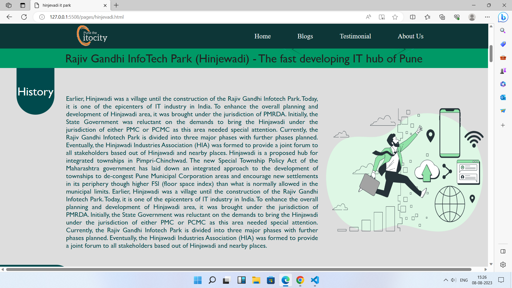
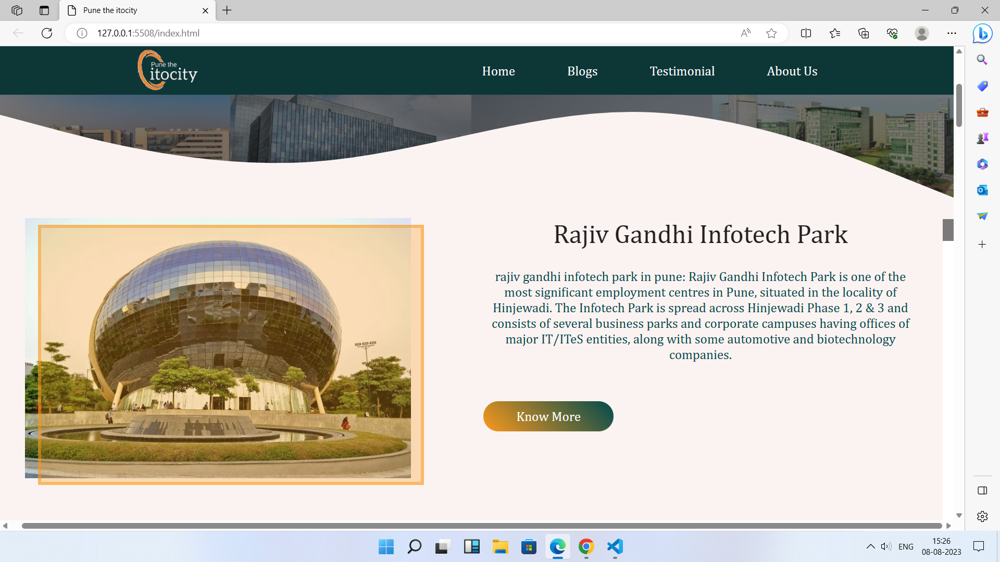

# ITOCITY - Your Ultimate IT Park Resource 🏢
Welcome to ITOCITY, your comprehensive online resource tailored for computer science students. Our dedicated team has curated this website to serve as your go-to destination for delving into the world of IT parks in Pune.

# Navigating the Website
To immerse yourself in a seamless experience, simply visit our website at https://pune-the-itocity-igcp-group-project.netlify.app/. Here, you'll effortlessly access a treasure trove of information about the thriving IT companies nestled in Pune.

## image of our website

# The Purpose of Our Project
The driving force behind ITOCITY was to furnish individuals, especially IT enthusiasts, with a reliable platform to gather comprehensive insights about the bustling IT park scene in Pune.

# Unveiling the Creation
Our creation, the ITOCITY project, was meticulously crafted using HTML and CSS. This dynamic platform enables users to peruse valuable data regarding all IT parks in Pune. We've left no stone unturned, offering intricate details about each park's locations, the number of buildings within, and streamlined connectivity.

# Real-world Application
ITOCITY finds real-world utility in providing users with ready access to crucial information about Pune's IT parks. This encompasses not only the physical layout of these parks but also means to establish direct communication with companies situated within.

# Glimpse into the Future
The prospects for "The IT City Pune" project are undeniably promising. As Pune continues its metamorphosis into an Information Technology hub, the project stands as a testament to the city's tech-driven evolution. With the ongoing digital revolution and the rapid progress of technology, Pune's IT landscape is primed for a remarkable transformation.

# Contributing to the Vision

Made with [contrib.rocks](https://contrib.rocks).
